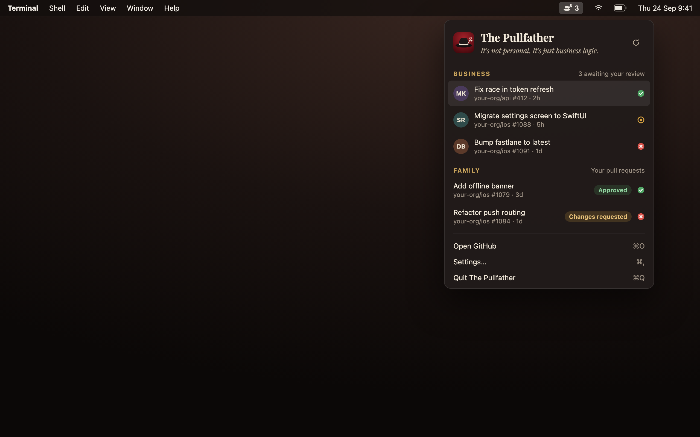

<p align="center">
  
</p>

<h1 align="center">The Pullfather</h1>

<p align="center"><em>It's not personal. It's just business logic.</em></p>

<p align="center">
  A macOS menu bar app for GitHub pull requests. Two lists, always current, nothing else.
</p>

<p align="center">
  
</p>

> **Status:** in development. The design is settled; the code is on its way. Follow the plan in [#1](https://github.com/oronbz/pullfather/issues/1).

## The arrangement

The Pullfather keeps track of two kinds of business, and only two.

- **Business**: pull requests waiting on your review, whether someone asked you by name or asked a team you're on. Longest-waiting first, because nobody likes being kept waiting.
- **Family**: the pull requests you opened, drafts included, with their review verdict and CI status. Most recent activity first.

The number next to the fedora in your menu bar is how many favors are being asked of you.

## Why it exists

Other PR menu bar apps refresh the count and the list separately, so the number says one thing and the list says another. The Pullfather fetches everything in one request per sync. The count and the list come from the same answer, so they never disagree.

- Opening the popover shows the last results instantly and syncs in the background.
- It syncs every minute by default, and again when your Mac wakes or the network comes back.
- If GitHub is unreachable, you keep the last good list and a quiet note saying how old it is.

## What's coming in 0.1.0

- Business and Family sections, with CI status on every row and review badges on yours
- A notification when a new pull request needs your review ("3 new favors asked" when they come in bunches)
- Keyboard first: a global hotkey (⌃⇧⌘P by default), arrow keys and Enter, plus ⌘R to refresh
- Follows your system's light or dark appearance
- Launches at login and has no Dock icon

## Install

Once 0.1.0 is out:

```sh
brew install --cask oronbz/tap/pullfather
```

The app is ad-hoc signed, not notarized. If macOS refuses to open it the first time, go to **System Settings → Privacy & Security** and click **Open Anyway**.

## Signing in

Paste a classic GitHub personal access token with `repo` scope. It covers every org you belong to. If you already use the `gh` CLI, you can import its token with one click instead.

Fine-grained tokens aren't supported. They only cover a single owner, so pull requests from your other orgs wouldn't show.

The token is stored in a file in `~/Library/Application Support/Pullfather` that only your user account can read. It never goes in the Keychain, so you never get a Keychain password prompt, not even after an update. [ADR-0002](docs/adr/0002-token-in-file-not-keychain.md) explains why.

## Requirements

macOS 26 (Tahoe) or later.

## For contributors

- [`CONTEXT.md`](CONTEXT.md) defines the domain language: Business, Family, Sync, Waiting Time, Arrival. Use these terms in code and issues.
- [`docs/adr/`](docs/adr) records the decisions that would surprise you.
- [`design/`](design) holds the icon, the menu bar glyph and the popover spec.
- Issues are the plan. Anything labelled `ready-for-agent` is fair game.
